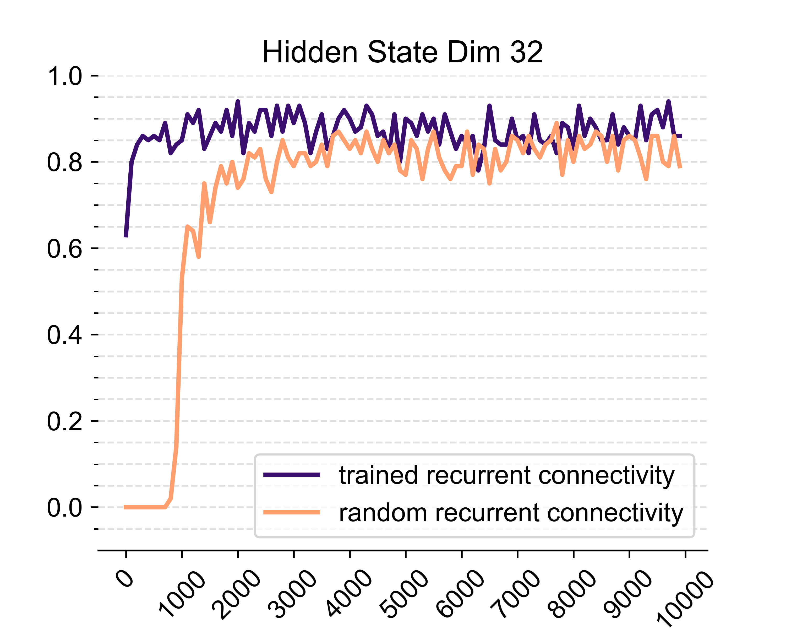
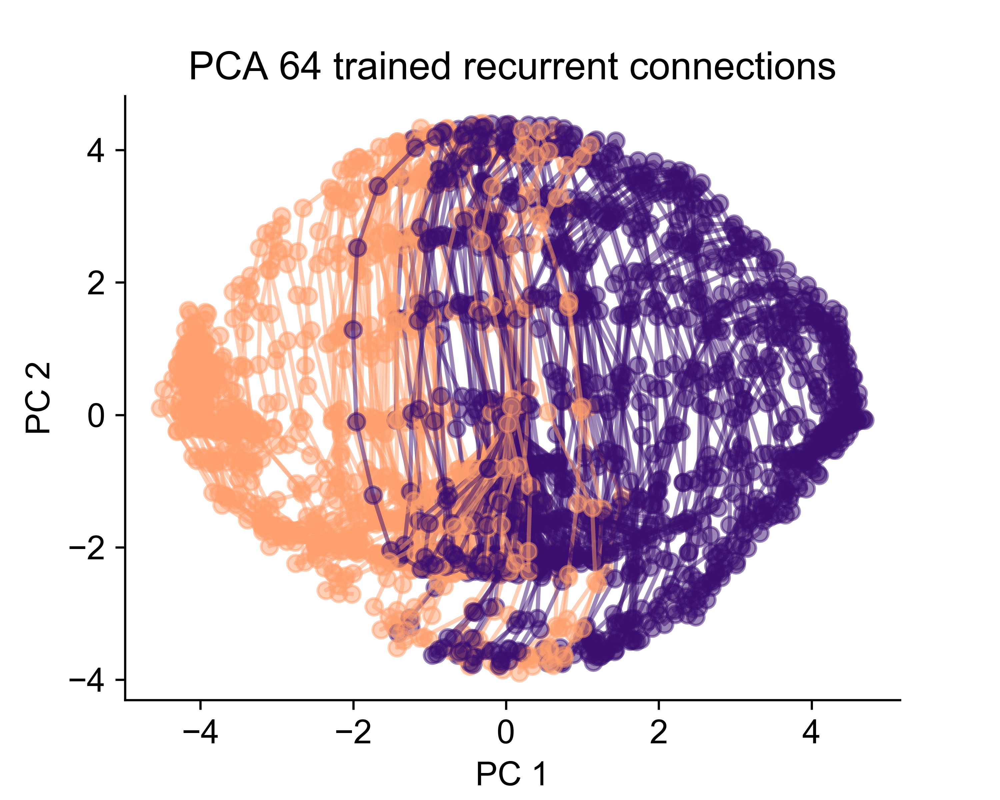

# RNN trained on neuroscience behavioral tasks

## Evaluating the hidden dimensions of a recurrent network needed to solve a perceptual decision making task and whether training the recurrent connections is necessary for solving the task

### A project that I did as part of the IBRO-Simons Computational Neuroscience Imbizo 2022 in Cape Town, South Africa.

## Example performances
 
 

## Looking at the evolving dynamics over time using PCA
 
 
 
